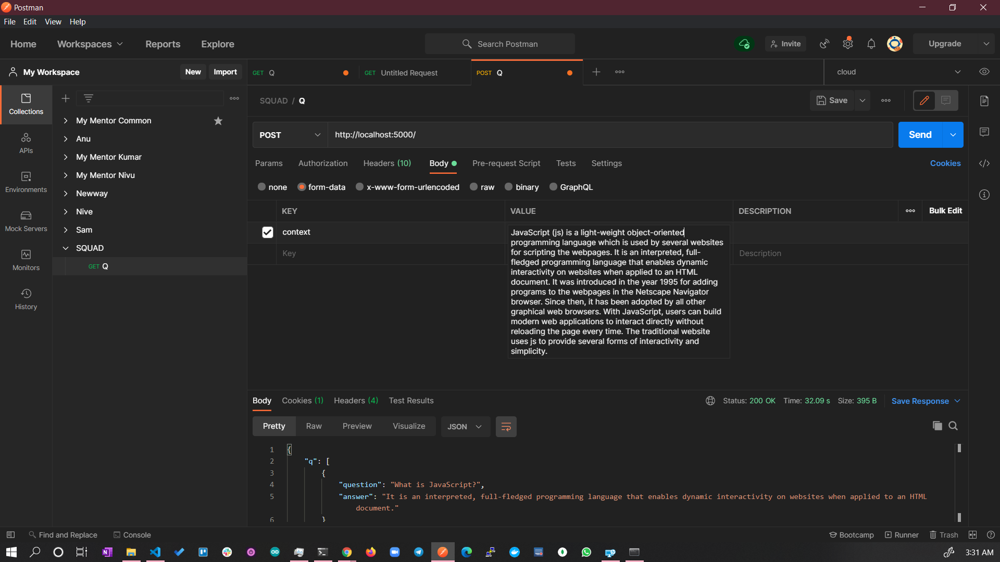

# question_generator

Question Generator is an NLP system for generating reading comprehension-style questions from texts such as news articles or pages excerpts from books. The system is built using pretrained models from [HuggingFace Transformers](https://github.com/huggingface/transformers). There are two models: the question generator itself, and the QA evaluator which ranks and filters the question-answer pairs based on their acceptability.

## Installation

You can clone the repo and then install the package like this:

```
<<<<<<< HEAD
conda create env --name nlp
git clone https://github.com/nunnarilabs/question_generator```
pip install -r requirements.txt
=======
conda create --name nlp python=3.8
conda activate nlp
git clone https://github.com/nunnarilabs/question_generator
cd question_generator
pip install -r old.txt
>>>>>>> 98b86c858c29e696a3af1d9ff48140f61f59cd5a
```

## Run API Server 

```
python api.py
```




## Answer Evaluation

- Tried to add flask api, it needs seperate instance of tensorflow. 

[api2.py](api2.py)

https://colab.research.google.com/drive/1uQeiZDS1lDzcayPpJQsDiYqqnJj2ZCpy?usp=sharing


## Context

### Javascript

https://www.javatpoint.com/javascript-tutorial

## Usage

The easiest way to generate some questions is to clone the github repo and then run `qg_run.py` like this:

```
python 'question_generator/run_qg.py' --text_dir 'question_generator/articles/twitter_hack.txt'
```

This will generate 10 question-answer pairs of mixed style (full-sentence and multiple choice) based on the article specified in `--text_dir` and print them to the console. For more information see the qg_commandline_example notebook.

The `QuestionGenerator` class can also be instantiated and used like this:

```python
from questiongenerator import QuestionGenerator
qg = QuestionGenerator()
qg.generate(text, num_questions=10)
```

This will generate 10 questions of mixed style and return a list of dictionaries containing question-answer pairs. In the case of multiple choice questions, the answer will contain a list of dictionaries containing the answers and a boolean value stating if the answer is correct or not. The output can be easily printed using the `print_qa()` function. For more information see the question_generation_example notebook.

### Choosing the number of questions

The desired number of questions can be passed as a command line argument using `--num_questions` or as an argument when calling `qg.generate(text, num_questions=20`. If the chosen number of questions is too large, then the model may not be able to generate enough. The maximum number of questions will depend on the length of the input text, or more specifically the number of sentences and named entities containined within text. Note that the quality of some of the outputs will decrease for larger numbers of questions, as the QA Evaluator ranks generated questions and returns the best ones.

### Answer styles

The system can generate questions with full-sentence answers (`'sentences'`), questions with multiple-choice answers (`'multiple_choice'`), or a mix of both (`'all'`). This can be selected using the `--answer_style` or `qg.generate(answer_style=<style>)` arguments.

## Models

### Question Generator

### issues

- https://github.com/tensorflow/tensorflow/issues/38518

### REference

- https://github.com/AMontgomerie/question_generator
- https://huggingface.co/iarfmoose/t5-base-question-generator
- https://www.javatpoint.com/javascript-tutorial
- https://huggingface.co/distilbert-base-uncased-distilled-squad
